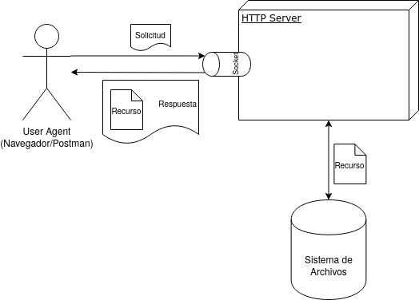

# Primer proyecto programado #

El proyecto consiste en diseñar y desarrollar un servidor web capaz de comunicarse con navegadores a través del protocolo HTTP.

## Objetivos formativos ##

* Utilizar el protocolo HTTP para comunicarse con un navegador web. Este protocolo es un componente esencial para el desarrollo de software web; y por tanto es de suma importancia que las personas estudiantes conozcan los detalles básicos de este estándar.

* Describir el funcionamiento básico detrás de la implementación de servidores web como Apache o nginx. Este tipo de plataformas permiten la construcción de sistemas de información en web.

* Diseñar los componentes para un software de complejidad media aplicando los principios de diseño SOLID.

## Objetivos de curso ##

* Aplicar técnicas y herramientas orientadas a objetos para la modelación del diseño de software.

* Documentar la toma de decisiones durante la etapa de diseño del software.

* Comprender los diferentes niveles de abstracción en que deben expresarse las soluciones de problemas de diseño.

## Contenidos del curso ##

* Introducción/vistazo al diseño y arquitectura de software.

* Principios de diseño.

* El diseño detallado del software.

* Tendencias en el diseño de software.

## Especificación ##

### Épica ###

Desarrollar un servidor web que soporte los métodos `GET` y `HEAD` para responder a solicitudes por recursos en el sistema de archivos.

### Historias de usuario ###

1. Como el usuario agente (*navegador*), quiero enviar al servidor una solicitud (*request*) con el método `GET`, para obtener como respuesta (*response*) un archivo almacenado en el sistema de archivos del servidor.

Solicitud a [GET http://localhost:8008/helloworld.html](http://localhost:8008/helloworld.html)

```http
GET /helloworld.html HTTP/1.1
User-Agent: PostmanRuntime/7.22.0
Accept: */*
Cache-Control: no-cache
Host: localhost
Accept-Encoding: gzip, deflate, br
Connection: keep-alive
```

Respuesta

```http
HTTP/1.1 200 OK
Server: byohttp/0.0.1
Date: Tue, 10 Mar 2020 01:57:21 GMT
Content-Type: text/html
Content-Length: 95
Last-Modified: Tue, 10 Mar 2020 01:57:00 GMT
Connection: keep-alive
Accept-Ranges: bytes

<html>
<head>
<title>Hello world!</title>
</head>
<body>
<h1>Hello world!</h1>
</body>
</html>
```

2. Como el usuario agente, quiero enviar al servidor una solicitud (*request*) con el método `HEAD`, para obtener como respuesta (*response*) un archivo almacenado en el sistema de archivos del servidor.

Solicitud a [HEAD http://localhost:8008/helloworld.html](http://localhost:8008/helloworld.html)

```http
GET /helloworld.html HTTP/1.1
User-Agent: PostmanRuntime/7.22.0
Accept: */*
Cache-Control: no-cache
Host: localhost
Accept-Encoding: gzip, deflate, br
Connection: keep-alive
```

Respuesta

```http
HTTP/1.1 200 OK
Server: byohttp/0.0.1
Date: Tue, 10 Mar 2020 01:57:21 GMT
Content-Type: text/html
Content-Length: 95
Last-Modified: Tue, 10 Mar 2020 01:57:00 GMT
Connection: keep-alive
Accept-Ranges: bytes
```

3. Como el usuario agente, quiero enviar al servidor una solicitud (*request*) con cualquier método excepto `GET` o `HEAD`, para obtener como respuesta (*response*) un código de error `501 Not Implemented`.

Solicitud a [PUT http://localhost:8008/helloworld.html](http://localhost:8008/helloworld.html)

```http
PUT /helloworld.html HTTP/1.1
User-Agent: PostmanRuntime/7.22.0
Accept: */*
Cache-Control: no-cache
Host: localhost
Accept-Encoding: gzip, deflate, br
Connection: keep-alive
```

Respuesta

```http
HTTP/1.1 501 Not Implemented
Server: byohttp/0.0.1
Date: Tue, 10 Mar 2020 16:31:16 GMT
Content-Type: text/html
Content-Length: 157
Connection: close

<html>
<head><title>501 Not Implemented</title></head>
<body>
<center><h1>501 Not Implemented</h1></center>
<hr><center>byohttp/0.0.1</center>
</body>
</html>
```

4. Como el usuario agente, quiero enviar al servidor una solicitud (*request*) con el método `GET` o `HEAD` de un recurso que no existe en el servidor, para obtener como respuesta (*response*) un código de error `404 Not Found`.

```http
GET /helloworld.html HTTP/1.1
User-Agent: PostmanRuntime/7.22.0
Accept: */*
Cache-Control: no-cache
Host: localhost
Accept-Encoding: gzip, deflate, br
Connection: keep-alive
```

Respuesta

```http
HTTP/1.1 404 Not Found
Server: byohttp/0.0.1
Date: Tue, 10 Mar 2020 16:35:02 GMT
Content-Type: text/html
Content-Length: 153
Connection: keep-alive

<html>
<head><title>404 Not Found</title></head>
<body>
<center><h1>404 Not Found</h1></center>
<hr><center>byohttp/0.0.1</center>
</body>
</html>
```

### Arquitectura ###



* El servidor se comunicará con los usuarios agentes a través de un socket escuchando en un puerto TCP (ej. `8008`).

* La comunicación con el servidor debe ser asincrónica, es decir cada solicitud debe ser procesada por su propio hilo.

* El servidor tendrá acceso a un directorio específico donde se encontrarán los recursos que servirá.

* Los siguientes datos deben ser parámetros configurables del sistema:

  * El puerto en el que escucha el socket.

  * La ruta en el sistema de archivos donde se encuentran los recursos servidos.

  * La asociación entre extensiones de archivo y tipos MIME.

* El servidor debe mantener una bitácora (*log*) donde se registren todas las solicitudes recibidas y respuestas generadas. En primera instancia esta bitácora se enviará a la salida estándar (`stdout`). En el futuro se podrá configurar la salida a la que se enviará la bitácora.

* Cualquier error no esperado durante la resolución de una solicitud deberá manejarse como una respuesta `500 Internal Server Error`.

* En el futuro el servidor deberá soportar todos los métodos HTTP.

* En el futuro el servidor no sólo deberá servir recursos almacenados en el sistema de archivos, sino también recursos generados dinámicamente a través de la invocación de funciones siguiendo el protocolo *REST*.

### Recursos ###

* [Formato de mensajes HTTP](https://en.wikipedia.org/wiki/Hypertext_Transfer_Protocol#Message_format)

* [Sockets](https://docs.oracle.com/javase/tutorial/networking/sockets/index.html)

* [Referencia oficial HTTP](https://developer.mozilla.org/en-US/docs/Web/HTTP)

* [Tipos MIME](https://developer.mozilla.org/en-US/docs/Web/HTTP/Basics_of_HTTP/MIME_types/Common_types)

## Metodología ##

* El proyecto se desarrollará en grupos de 5 personas.

* El proyecto seguirá un proceso de desarrollo ágil; consistirá de dos iteraciones (*sprints*) de una semana cada uno. El tiempo de clase será utilizado como sesión de planificación y diseño (*sprint planning*) mientras que el tiempo extraclase se utilizará para ejecutar el diseño planificado. El producto de la sesión de planificación será una serie de tareas documentadas en el gestor de tareas asociado con el repositorio de código y asignadas a los miembros del equipo.

* Cada miembro del equipo trabajará cada una de sus tareas en una rama (*branch*) aparte; se recomienda usar el formato `feature/<# tarea>` para nombrar las tareas. Para que una tarea se considere completa debe realizarse la programación así como las pruebas automatizadas correspondientes. Cuando la tarea es finalizada, se debe crear un *pull request* que deberá ser revisado y aprobado por otro miembro del equipo antes de fusionarla (*merge*) con la rama *master*. Cada miembro del equipo de revisar al menos un *pull request* por iteración. La revisión del *pull request* debe incluir asegurarse de que el código en esa rama compile correctamente y pase todas las pruebas automatizadas.

* Además del código funcional y las pruebas automatizadas, se debe entregar la documentación del proyecto en el archivo `DOC.md`. La documentación debe incluir secciones que indiquen cómo configurar y construir el software, cómo ejecutar el software y cuál es el diseño del software incluyendo diagramas de clase, de secuencia o de actividad, acompañadas por explicaciones cuando se considere necesario.

## Rúbrica ##

### Planificación 1 (5 pts) ###

* (5) Documenta y se asigna una o más tareas a desarrollar durante la iteración. Las tareas incluyen una descripción del trabajo a realizar así como los correspondientes artefactos de diseño.

* (3) Documenta y se asigna una o más tareas a desarrollar durante la iteración. Algunas de las tareas no tienen una descripción adecuada o no incluyen artefactos de diseño.

* (1) Documenta y se asigna una o más tareas a desarrollar durante la iteración. La mayoría de las tareas no tienen una descripción adecuada o no incluyen artefactos de diseño.

### Desarrollo de tareas 1 (5 pts) ###

* (5) Completa todas las tareas que le son asignadas.

* (3) Completa la mayoría de las tareas que le son asignadas.

* (1) No completa la mayoría de las tareas que le son asignadas.

### Revisión de pares 1 (5 pts) ###

* (5) Identifica oportunamente los problemas de calidad, estética y diseño. O reconoce adecuadamente la ausencia de problemas importantes de calidad, estética y diseño.

* (3) Pasa por alto algunos problemas importantes de calidad, estética o diseño.

* (1) Hace una revisión superficial pasando por alto la mayoría de problemas fundamentales relacionados con la completitud de la tarea o problemas de calidad, estética o diseño.

### Planificación 2 (5 pts) ###

* (5) Documenta y se asigna una o más tareas a desarrollar durante la iteración. Las tareas incluyen una descripción del trabajo a realizar así como los correspondientes artefactos de diseño.

* (3) Documenta y se asigna una o más tareas a desarrollar durante la iteración. Algunas de las tareas no tienen una descripción adecuada o no incluyen artefactos de diseño.

* (1) Documenta y se asigna una o más tareas a desarrollar durante la iteración. La mayoría de las tareas no tienen una descripción adecuada o no incluyen artefactos de diseño.

### Desarrollo de tareas 2 (5 pts) ###

* (5) Completa todas las tareas que le son asignadas.

* (3) Completa la mayoría de las tareas que le son asignadas.

* (1) No completa la mayoría de las tareas que le son asignadas.

### Revisión de pares 2 (5 pts) ###

* (5) Identifica oportunamente los problemas de calidad, estética y diseño. O reconoce adecuadamente la ausencia de problemas importantes de calidad, estética y diseño.

* (3) Pasa por alto algunos problemas importantes de calidad, estética o diseño.

* (1) Hace una revisión superficial pasando por alto la mayoría de problemas fundamentales relacionados con la completitud de la tarea o problemas de calidad, estética o diseño.

### Documentación (5 pts) ###

* (5) El proyecto cumple con todos los elementos de la documentación solicitada.

* (3) El proyecto cumple con la mayoría de elementos de la documentación solicitada.

* (1) El proyecto no cumple con la mayoría de elementos de la documentación solicitada.

Total: **35 pts**
